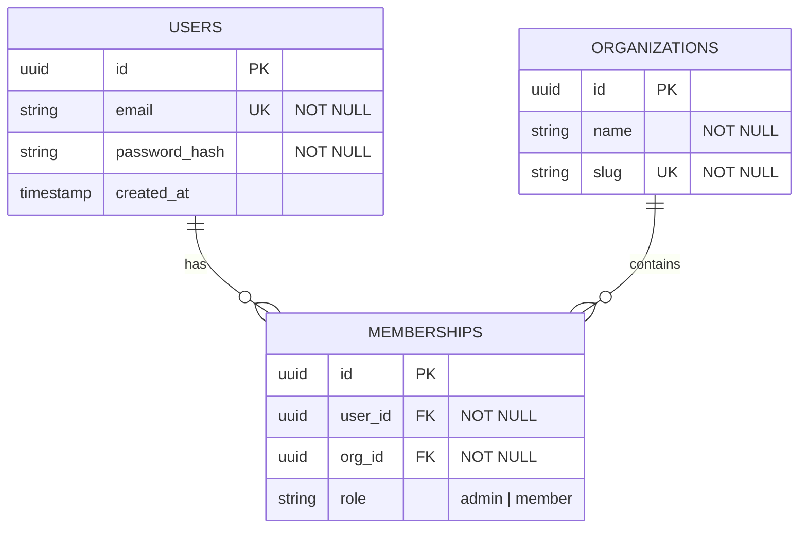

# Database Schema & Mermaid ERD Architecture Runbook

## Mission

Transform raw SQL DDL definitions, migrations, and ORM models into visual, interactive Mermaid Entity-Relationship Diagrams (ERD). When designing scalable backends, developers need an instant way to visualize data topology, spot missing foreign key indexes, detect circular references, and verify 3rd Normal Form (3NF) compliance. This skill extracts table schemas, identifies relational cardinalities (1:1, 1:N, N:M), and renders self-documenting Mermaid ERDs.

---

## Relational Modeling & Cardinality Mapping

```
┌────────────────────────────────────────────────────────────────────────────┐
│                        Mermaid ERD Cardinality Notation                    │
├──────────────┬─────────────────────────────┬───────────────────────────────┤
│ Symbol       │ Cardinality Meaning         │ Example                       │
├──────────────┼─────────────────────────────┼───────────────────────────────┤
│ ||--||       │ Exactly One to Exactly One  │ User Profile to User Account  │
│ ||--o{       │ Exactly One to Zero or More │ User to Orders                │
│ }o--o{       │ Zero or More to Zero or More│ Students to Courses (Junction)│
│ ||--|{       │ Exactly One to One or More  │ Order to OrderItems           │
└──────────────┴─────────────────────────────┴───────────────────────────────┘
```

---

## Step-by-Step Architecture Protocol

### Phase 1: DDL Schema Extraction & Ingestion
1. Locate SQL schema files (`schema.sql`, `init.sql`, `prisma/schema.prisma`, `migrations/*.sql`).
2. Extract all `CREATE TABLE` blocks, data types (`UUID`, `VARCHAR`, `TIMESTAMP`, `INT`), column modifiers (`NOT NULL`, `DEFAULT`, `PRIMARY KEY`), and constraints (`FOREIGN KEY REFERENCES`).

### Phase 2: Execute Mermaid ERD Generation
1. Call `db_generate_erd` passing the concatenated SQL DDL text.
2. Structure output into standard Mermaid ERD format:



### Phase 3: Relational Integrity & Performance Audit
1. **Primary Key Check**: Verify every table possesses a primary key (`UUIDv7` or `BIGINT IDENTITY`).
2. **Foreign Key Indexing**: Flag any foreign key column (`org_id`, `user_id`) lacking an explicit `CREATE INDEX`.
3. **Temporal Tracking**: Verify business entities include `created_at` and `updated_at` timestamps.

---

## Quality Gate Checklist

- [ ] **All Foreign Keys Resolvable**: No dangling references to non-existent parent tables.
- [ ] **Junction Tables Defined**: Many-to-many relationships decomposed with intermediate junction tables.
- [ ] **Mermaid Syntax Validated**: Formatted with standard `erDiagram` syntax and markdown fenced blocks.
- [ ] **Enum / Value Constraints Documented**: Status columns document allowed values (`active`, `pending`, `archived`).
