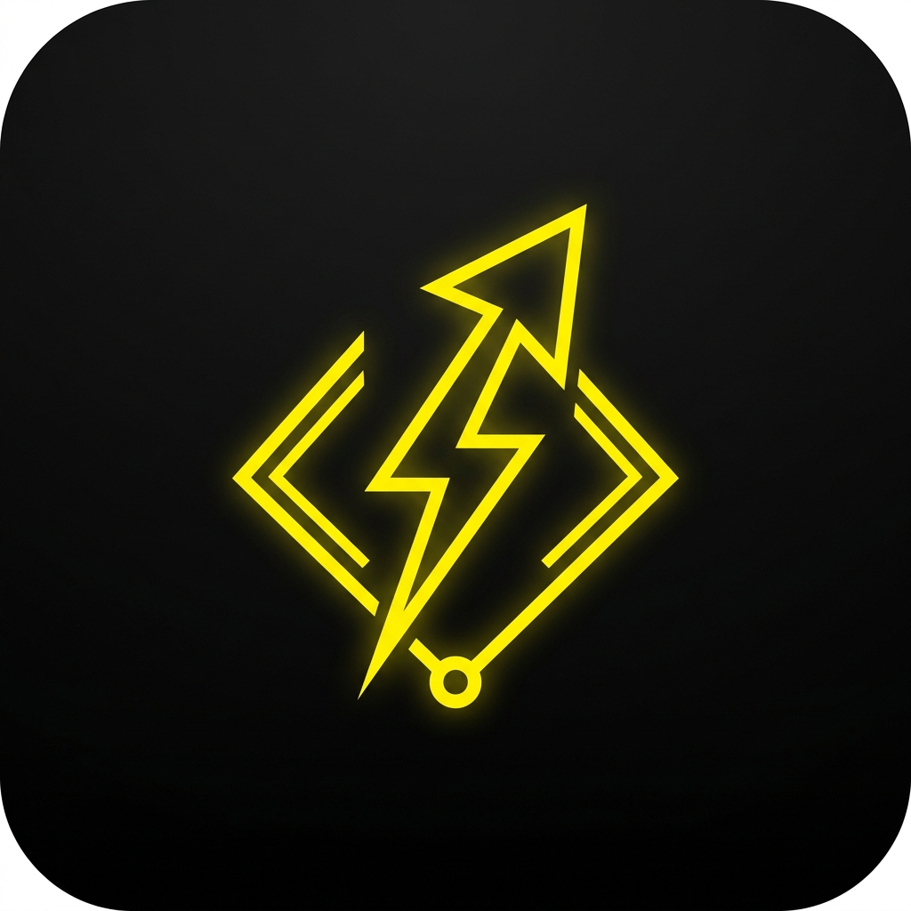
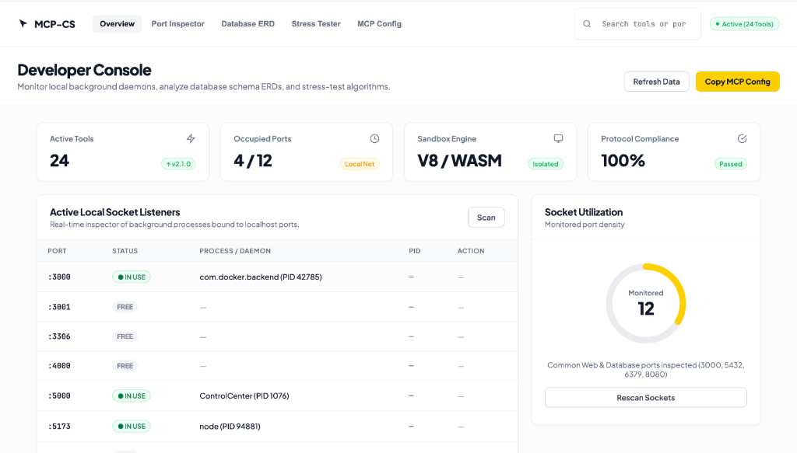
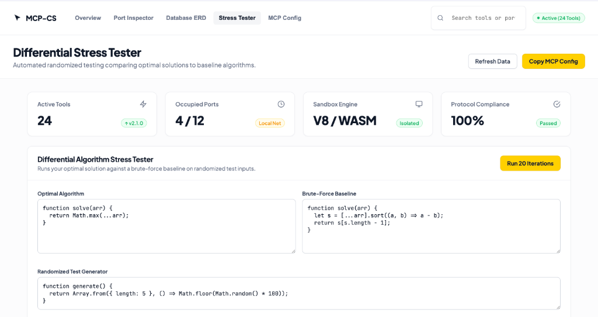

<div align="center">



<br/><br/>

# ⚡ MCS (`mcp-cs`)
### The Universal Campus Developer, Diagnostics & AlgoJudge Competitive Execution Suite

[](https://www.npmjs.com/package/mcp-cs)
[](https://opensource.org/licenses/MIT)
[](https://nodejs.org)
[](https://modelcontextprotocol.io)
[](https://github.com/ieeecsopen)

**MCS** (*Model Context Server for Computer Society*) is a full-featured [Model Context Protocol (MCP)](https://modelcontextprotocol.io) server and visual console created for developers, university students, competitive programmers, and engineering teams.

[Installation](#-installation-guide) • [Visual Console](#-interactive-visual-dashboard) • [Client Configuration](#-client-configuration) • [Tool Catalog](#-complete-tool-catalog-24-tools) • [Homebrew](#-homebrew-installation)

<br/>



</div>

---

## 🌟 Why MCS?

**MCS** connects your AI assistant (**Antigravity, Cursor, Claude Desktop, Windsurf, Cline**) directly to powerful local execution, repository diagnostics, database modeling, and competitive algorithm tools with **zero manual configuration**.

- ⚡ **AlgoJudge Engine**: Run sandboxed code (Python, JS/TS, C++, Go), perform automated differential stress-testing, and check AST code similarity.
- 🩺 **Environment Doctor**: Diagnose project setups, detect `.env` disparities, and inspect port conflicts with process PIDs.
- 🗄️ **Database & ERD**: Parse SQL schemas and auto-generate Mermaid Entity-Relationship diagrams.
- ⚡ **Web Performance**: Scan for oversized raster assets and audit HTTP compression & security headers.
- 🛡️ **Security Guard**: Detect leaked API keys, tokens, and hardcoded credentials before committing.
- 🌐 **API Playground**: Live HTTP test client and realistic synthetic mock data generator.

---

## 🖥️ Interactive Visual Dashboard

Launch the embedded graphical visualizer locally with either command:

```bash
mcs --ui
# or
npx mcp-cs --ui
```

<div align="center">
  
</div>

---

## 📦 Installation Guide

You can install and use **MCS** through any of the following methods:

### Method 1: Instant Run via `npx` *(Recommended — No install needed)*
```json
{
  "mcpServers": {
    "mcs": {
      "command": "npx",
      "args": ["-y", "mcp-cs"]
    }
  }
}
```

---

### Method 2: Homebrew Installation (macOS & Linux)
```bash
brew tap ieeecsopen/tap
brew install mcs
```
*(Or install `mcp-cs`: `brew install ieeecsopen/tap/mcp-cs`)*

---

### Method 3: Global NPM Installation
```bash
npm install -g mcp-cs
```
*(Installs both `mcs` and `mcp-cs` executable commands)*

---

### Method 4: 1-Click Installation via Smithery
```bash
npx -y @smithery/cli install mcp-cs --client claude
```

---

## 🔌 Client Configuration

### 1. Antigravity IDE
Add `mcs` to your global configuration file at `~/.gemini/config/mcp_config.json`:

```json
{
  "mcpServers": {
    "mcs": {
      "command": "npx",
      "args": ["-y", "mcp-cs"]
    }
  }
}
```

---

### 2. Claude Desktop
Add to your Claude configuration file:
- **macOS:** `~/Library/Application Support/Claude/claude_desktop_config.json`
- **Windows:** `%APPDATA%\Claude\claude_desktop_config.json`

```json
{
  "mcpServers": {
    "mcs": {
      "command": "npx",
      "args": ["-y", "mcp-cs"]
    }
  }
}
```

---

### 3. Cursor IDE
1. Open **Settings** (`Cmd + ,` on Mac or `Ctrl + ,` on Windows).
2. Go to **Features** $\to$ **MCP**.
3. Click **+ Add New MCP Server**:
   - **Name:** `mcs`
   - **Type:** `command`
   - **Command:** `npx -y mcp-cs`

---

### 4. Remote Teams — MCS Relay (Hosted SSE, no local Node.js needed)

If your organization runs a hosted Relay instance (see [🛰️ MCS Relay](#-mcs-relay--hosted-cloud-deployment) below), teammates connect straight to the remote URL instead of running anything locally. Ask whoever manages your Relay deployment for the URL and your team's Bearer token, then point your client at it:

**Cursor / Windsurf / Claude Desktop** (exact field names vary slightly by client version — check that client's current remote-MCP docs if this doesn't connect):
```json
{
  "mcpServers": {
    "mcs-relay": {
      "url": "https://mcp.ieeecs-sliit.org/sse",
      "headers": {
        "Authorization": "Bearer <your-team-token>"
      }
    }
  }
}
```

No `npx`, no local Node.js install, no per-machine setup — the same URL and token work for everyone on the team, and revoking one team's token doesn't affect any other team's connection.

---

## 🛠️ Complete Tool Catalog (24 Tools)

### ⚡ 1. AlgoJudge Competitive & Algorithm Engine
| Tool | Description | Example Prompt |
| :--- | :--- | :--- |
| `algo_run_sandboxed` | Runs code in Python, JS, TS, C++, C, or Go in an isolated process with strict time and memory limits. | *"Run this C++ solution with the test input `5\n1 2 3 4 5`."* |
| `algo_stress_test` | **Automated Differential Tester:** Compares an optimal algorithm against a brute-force baseline on randomized inputs to find failing edge cases. | *"Stress-test my Dijkstra implementation against a brute-force solution to find where it fails."* |
| `algo_check_plagiarism` | Token-based AST code similarity checker that compares two code submissions and detects suspicious duplicated logic. | *"Check if `solution_a.py` and `solution_b.py` have plagiarized logic."* |
| `algo_generate_edge_cases` | Generates adversarial corner cases (min $N=1$, max constraints, identical items, extreme negatives, disconnected graphs). | *"Generate edge testcases for a binary tree problem."* |

---

### 🗄️ 2. Database & Schema Suite
| Tool | Description | Example Prompt |
| :--- | :--- | :--- |
| `db_generate_erd` | Parses SQL `CREATE TABLE` and foreign key statements to automatically generate Mermaid Entity-Relationship Diagrams. | *"Generate a Mermaid ERD diagram from this `schema.sql` file."* |

---

### ⚡ 3. Web Performance Suite
| Tool | Description | Example Prompt |
| :--- | :--- | :--- |
| `perf_audit_assets` | Scans directory for uncompressed raster images (>250KB) and calculates bandwidth savings from WebP/AVIF conversion. | *"Audit the images in `/public` and show me how much size we can save with WebP."* |
| `perf_check_headers` | Audits HTTP response headers of a web application for Gzip/Brotli compression, Cache-Control, and security headers. | *"Check the performance and security headers on `http://localhost:3000`."* |

---

### 🩺 4. Environment & System Doctor
| Tool | Description | Example Prompt |
| :--- | :--- | :--- |
| `doctor_diagnose_project` | Auto-detects runtime (Node, Next.js, Python, Docker), missing `node_modules`, missing `.env`, and unconfigured virtual environments. | *"Diagnose why this repo won't start."* |
| `doctor_check_env` | Diffs `.env` against `.env.example` to detect missing or surplus keys. | *"Check if my `.env` is missing any keys from `.env.example`."* |
| `doctor_port_inspect` | Identifies which background processes and PIDs are locking ports (`3000`, `6379`, `5432`). | *"Check why port 6379 is occupied."* |

---

### 🛡️ 5. Security & Secrets Guard
| Tool | Description | Example Prompt |
| :--- | :--- | :--- |
| `security_scan_secrets` | Scans codebase for leaked OpenAI keys, AWS access tokens, GitHub PATs, and private keys. | *"Scan my repository for accidentally committed secrets."* |

---

### 🌐 6. API Client & Mock Generator
| Tool | Description | Example Prompt |
| :--- | :--- | :--- |
| `api_test_request` | Executes live HTTP calls (`GET`, `POST`, `PUT`, `DELETE`) with headers, auth, and query params — measures latency (TTFB) and formats JSON. | *"Send a GET request to `https://api.github.com/zen` and show the latency."* |
| `api_generate_mock_data` | Generates realistic synthetic mock datasets (`users`, `products`, `posts`, `transactions`) for frontend and backend testing. | *"Generate 10 mock user records with IDs and emails."* |

---

### 📚 7. Documentation & Code Hygiene
| Tool | Description | Example Prompt |
| :--- | :--- | :--- |
| `docs_check_broken_links` | Scans all markdown files (`.md`, `.mdx`) to detect broken internal links and dead file references. | *"Check all markdown files in the repo for broken links."* |
| `docs_extract_code_snippets`| Extracts all fenced code blocks from markdown documentation for quick inspection. | *"Extract all code snippets in `docs/` so we can verify their syntax."* |
| `code_find_todos` | Scans the codebase for `TODO`, `FIXME`, `HACK`, and `BUG` comments with line numbers and file paths. | *"Find all `TODO` and `FIXME` comments in the codebase."* |
| `code_inspect_heavy_dependencies` | Inspects `package.json` to identify bloated dependencies (moment, lodash, monaco, katex) with optimization tips. | *"Check if we have heavy dependencies slowing down our bundle."* |

---

### 🚀 8. Git, Release & CI/CD Suite
| Tool | Description | Example Prompt |
| :--- | :--- | :--- |
| `git_generate_changelog` | Parses conventional git commit history between tags and outputs a clean markdown changelog. | *"Generate a changelog for all commits since `v1.0.0`."* |
| `git_pr_readiness_check` | Verifies uncommitted files, unpushed commits, and branch health before opening a Pull Request. | *"Check if my branch is ready for a Pull Request."* |
| `git_generate_pr_description` | Generates a structured markdown Pull Request description summarizing branch commits and diffs. | *"Generate a structured PR description for my current branch."* |
| `problem_fetch_codeforces` | Fetches problem statements, sample inputs/outputs, tags, and contest limits from Codeforces. | *"Fetch the details for Codeforces problem 2060A."* |
| `ci_generate_workflow` | Generates production-ready GitHub Actions CI/CD workflows for Next.js, NPM Publishing, Docker, or Python. | *"Generate a GitHub Action workflow to automatically publish this package to NPM."* |

---

## 🧩 Interactive Prompts & Resources

### Slash Commands / Prompts:
- **`/diagnose-repo`**: Runs full system doctor diagnostics, checks environment variables, scans ports, and generates an onboarding report.
- **`/stress-test-solution`**: Interactive algorithm stress-testing assistant to find counter-example edge cases.
- **`/prepare-pr`**: Pre-flight PR creation checklist and summary.

### Dynamic Context Resources:
- `resource://system/ports`: Live socket feed of active network ports.
- `resource://git/status`: Real-time repository branch and sync state.

---

## 💻 Local Development

```bash
# 1. Clone repository
git clone https://github.com/ieeecsopen/mcp-cs.git
cd mcp-cs

# 2. Install dependencies
npm install

# 3. Run automated tests
npm test

# 4. Build TypeScript
npm run build

# 5. Start in development mode with UI
npm run dev -- --ui
```

---

## 🛰️ MCS Relay — Hosted Cloud Deployment

MCS runs locally via stdio by default (one process per developer, launched by their MCP client). **Relay** is the hosted, multi-tenant alternative: a single long-running daemon serving remote SSE connections over HTTPS, so whole teams can connect their Cursor, Windsurf, or Claude Desktop directly to a shared URL without installing Node.js locally.

Each incoming `/sse` connection gets its own isolated MCP server + transport instance internally — Relay is safe for many teams connecting concurrently, not just one client at a time.

### Configuration

| Env var | Required | Purpose |
|---|---|---|
| `RELAY_API_TOKENS` | **Yes** | Comma-separated Bearer tokens, one per team/org (e.g. `team-a-token,team-b-token`). The server refuses to start without at least one — Relay is never unauthenticated. |
| `PORT` | No (default `8080`) | Port to listen on. Fly.io injects this automatically. |

### Run locally

```bash
RELAY_API_TOKENS="dev-token" npm run start:relay
# or: RELAY_API_TOKENS="dev-token" node dist/index.js --relay --port 8080
```

Endpoints:
- `GET /sse` — SSE connect endpoint (needs `Authorization: Bearer <token>`)
- `POST /messages?sessionId=...` — message endpoint used internally by the client library (needs `Authorization: Bearer <token>`)
- `GET /health` — unauthenticated health probe (for load balancers / orchestrators)

### Deploy with Docker

The existing `Dockerfile` builds a runner image that starts in Relay mode by default:

```bash
docker build -t mcs-relay .
docker run -p 8080:8080 -e RELAY_API_TOKENS="team-a-token,team-b-token" mcs-relay
```

### Deploy to Fly.io

```bash
fly launch --no-deploy   # generates fly.toml from the Dockerfile, don't deploy yet
fly secrets set RELAY_API_TOKENS="team-a-token,team-b-token"
fly deploy
```

Point DNS for your chosen hostname (e.g. `mcp.ieeecs-sliit.org`) at the Fly.io app, then share `https://mcp.ieeecs-sliit.org/sse` plus each team's token — see [Remote Teams client config](#4-remote-teams--mcs-relay-hosted-sse-no-local-nodejs-needed) above.

### Deploy to AWS ECS

The same Docker image works unchanged on ECS (Fargate or EC2 launch type) behind an Application Load Balancer terminating TLS — set `RELAY_API_TOKENS` via an ECS task definition secret (Secrets Manager / SSM Parameter Store) rather than a plaintext environment variable, and point the ALB health check at `/health`.

### Rotating or adding a team's token

Update `RELAY_API_TOKENS` (append a new comma-separated value, or remove one to revoke) and restart the daemon — there's no database or persisted session state to migrate, so a restart is a clean, instant token rotation. In-flight sessions are dropped, so time it outside a team's active hours if you can.

---

## 📄 License & Community

Distributed under the **MIT License**.

Maintained with ❤️ by the **[IEEE Computer Society of SLIIT](https://github.com/ieeecsopen)**.
